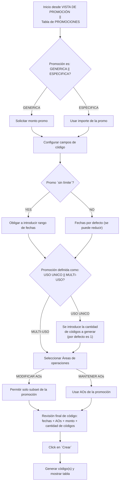

### CREACIÓN CÓDIGO FLOW

```mermaid
flowchart TD
	inicio["Inicio desde VISTA DE PROMOCIÓN \n||\n Tabla de PROMOCIONES"]
	inicio --> tipoPromo{"Promoción es: \nGENERICA || ESPECIFICA?"}
	tipoPromo --> |GENERICA| genPath[Solicitar monto promo]
	tipoPromo --> |ESPECIFICA| espPath[Usar importe de la promo]

	genPath --> configCommon
	espPath --> configCommon

	configCommon[Configurar campos de código]
	configCommon --> fechasCheck{"Promo `sin límite`?"}

	fechasCheck --> |YES| pedirFechas[Obligar a introducir rango de fechas]
	fechasCheck --> |NO| usarFechasPromo["Fechas por defecto (se puede reducir)"]

	pedirFechas --> frecuenciaCheck
	usarFechasPromo --> frecuenciaCheck

	frecuenciaCheck{"Promoción definida como:\nUSO UNICO || MULTI-USO?"}
	frecuenciaCheck --> |MULTI-USO| aoCheck
	frecuenciaCheck --> |USO UNICO| numCodes["Se introduce la cantidad\nde códigos a generar\n(por defecto es 1)"]

	numCodes --> aoCheck

	aoCheck[Seleccionar Áreas de operaciones]
	aoCheck -->|MODIFICAR AOs| restringirAOs[Permitir solo subset de la promoción]
	aoCheck -->|MANTENER AOs| mantenerAOs[Usar AOs de la promoción]

	restringirAOs --> resumen
	mantenerAOs --> resumen

	resumen[Revisión final de código: fechas + AOs + monto + cantidad de códigos]
	resumen --> crearBtn["Click en `Crear`"]
	crearBtn --> resultado["Generar código(s) y mostrar tabla"]
```
