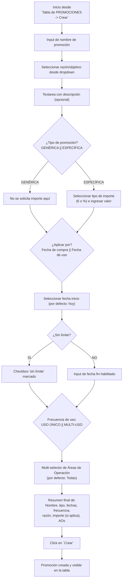

CREACIÓN PROMO FLOW
---

```mermaid
flowchart TD
  inicio["Inicio desde\n`Tabla de PROMOCIONES -> Crear`"]
  inicio --> nombre["Input de nombre de promoción"]
  nombre --> razon["Seleccionar razón/objetivo desde dropdown"]

  razon --> descripcion["Textarea con descripción (opcional)"]
  descripcion --> tipoPromo{"¿Tipo de promoción?\nGENÉRICA || ESPECÍFICA"}

  tipoPromo --> |GENÉRICA| genSkip[No se solicita importe aquí]
  tipoPromo --> |ESPECÍFICA| importe["Seleccionar tipo de importe\n(€ o %) e ingresar valor"]

  genSkip --> fechaTipo
  importe --> fechaTipo

  fechaTipo{"¿Aplicar por?\nFecha de compra || Fecha de uso"}
  fechaTipo --> fechaInicio["Seleccionar fecha inicio (por defecto: hoy)"]
  fechaInicio --> limiteCheck{"¿Sin límite?"}

  limiteCheck --> |SÍ| sinFechaFin["Checkbox 'sin límite' marcado"]
  limiteCheck --> |NO| fechaFin["Input de fecha fin habilitado"]

  sinFechaFin --> frecuencia
  fechaFin --> frecuencia

  frecuencia{"Frecuencia de uso:\nUSO ÚNICO || MULTI-USO"}
  frecuencia --> areas["Multi-selector de Áreas de Operación\n(por defecto: Todas)"]

  areas --> resumen["Resumen final de:\nNombre, tipo, fechas, frecuencia,\nrazón, importe (si aplica), AOs"]

  resumen --> crear["Click en `Crear`"]
  crear --> resultado["Promoción creada y visible en la tabla"]
```
