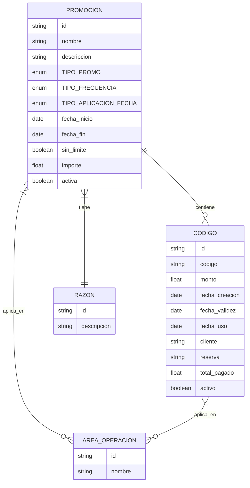

Promocion E/R
---

```mermaid
erDiagram
  PROMOCION ||--o{ CODIGO : contiene
  PROMOCION }|--|| RAZON : tiene
  PROMOCION }|--o{ AREA_OPERACION : aplica_en
  CODIGO }|--o{ AREA_OPERACION : aplica_en

  PROMOCION {
    string id
    string nombre
    string descripcion
    enum TIPO_PROMO 
    enum TIPO_FRECUENCIA
    enum TIPO_APLICACION_FECHA
    date fecha_inicio
    date fecha_fin
    boolean sin_limite
    float importe
    boolean activa
  }

  CODIGO {
    string id
    string codigo
    float monto 
    date fecha_creacion
    date fecha_validez
    date fecha_uso
    string cliente
    string reserva
    float total_pagado
    boolean activo
  }

  RAZON {
    string id
    string descripcion
  }

  AREA_OPERACION {
    string id
    string nombre
  }
```
