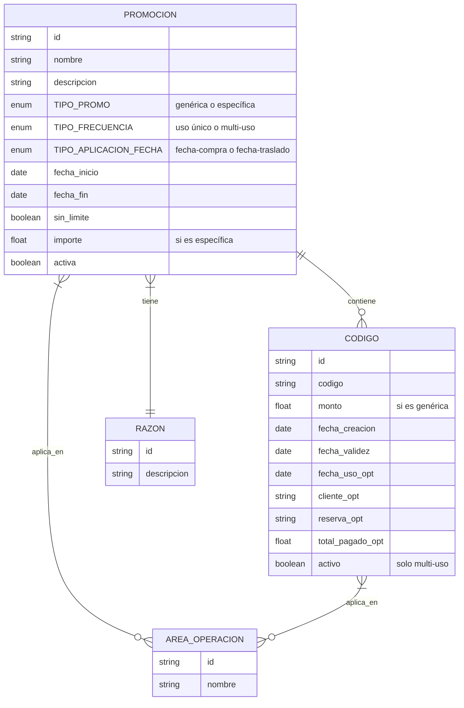

Promocion E/R
---

```mermaid
erDiagram
  PROMOCION ||--o{ CODIGO : contiene
  PROMOCION }|--|| RAZON : tiene
  PROMOCION }|--o{ AREA_OPERACION : aplica_en
  CODIGO }|--o{ AREA_OPERACION : aplica_en

  PROMOCION {
    string id
    string nombre
    string descripcion
    enum TIPO_PROMO "genérica o específica"
    enum TIPO_FRECUENCIA "uso único o multi-uso"
    enum TIPO_APLICACION_FECHA "fecha-compra o fecha-traslado"
    date fecha_inicio
    date fecha_fin
    boolean sin_limite
    float importe "si es específica"
    boolean activa
  }

  CODIGO {
    string id
    string codigo
    float monto "si es genérica"
    date fecha_creacion
    date fecha_validez
    date fecha_uso_opt
    string cliente_opt
    string reserva_opt
    float total_pagado_opt
    boolean activo "solo multi-uso"
  }

  RAZON {
    string id
    string descripcion
  }

  AREA_OPERACION {
    string id
    string nombre
  }
```
