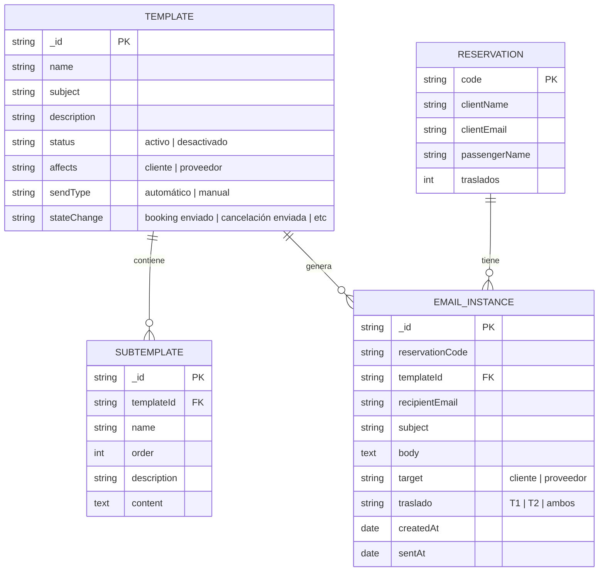

```mermaid
erDiagram
    TEMPLATE {
        string _id PK
        string name
        string subject
        string description
        string status "activo | desactivado"
        string affects "cliente | proveedor"
        string sendType "automático | manual"
        string stateChange "booking enviado | cancelación enviada | etc"
    }

    SUBTEMPLATE {
        string _id PK
        string templateId FK
        string name
        int order
        string description
        text content
    }

    EMAIL_INSTANCE {
        string _id PK
        string reservationCode
        string templateId FK
        string recipientEmail
        string subject
        text body
        string target "cliente | proveedor"
        string traslado "T1 | T2 | ambos"
        date createdAt
        date sentAt
    }

    RESERVATION {
        string code PK
        string clientName
        string clientEmail
        string passengerName
        int traslados
    }

    TEMPLATE ||--o{ SUBTEMPLATE : contiene
    TEMPLATE ||--o{ EMAIL_INSTANCE : genera
    RESERVATION ||--o{ EMAIL_INSTANCE : tiene
```
